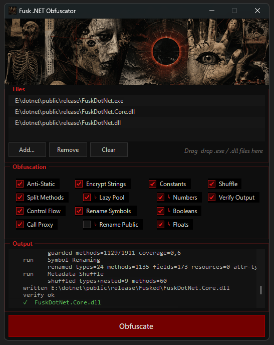

# Fusk .NET Obfuscator

A lightweight .NET obfuscator designed to resist static analysis while maintaining reliability and runtime performance, using dnlib.

## Table of Contents

- [Design Philosophy](#design-philosophy)
- [Key Features](#key-features)
- [Core Obfuscation Strategies](#core-obfuscation-strategies)
- [Usage Instructions](#usage-instructions)
- [Limitations and Scope](#limitations-and-scope)
- [License](#license)

## Design Philosophy

Fusk .NET Obfuscator operates under the principle of balancing reliability and runtime performance:

1. **Defeating Static Deobfuscation:** The primary target is to defeat automated static analysis and deobfuscation tools (such as `de4dot`) through advanced static hardening, while maintaining strict adherence to stability and performance as outlined below.
2. **Preservation of Execution Semantics (1:1 Compatibility):** Every protection pass operates under a conservative safety model. If an IL construct, method structure, or reference cannot be definitively analyzed as safe for transformation, the pass skips it. Preserving application correctness is prioritized over maximum obfuscation coverage to eliminate runtime regressions.
3. **Minimal Runtime Impact:** Obfuscations target metadata and IL structures statically. The generated code runs at native speed with negligible overhead, avoiding heavy decryption loops, virtualization layers, or custom runtime interpreters that degrade execution performance.

## Key Features

Fusk .NET Obfuscator implements dynamic and polymorphic IL-level transformations:

- **Polymorphism Per Run:** All encryption keys, mathematical constant decoders, control flow state IDs, and block ordering permutations are derived from a random number generator initialized per build. Pushing the same source code twice yields distinct binary structures.
- **De-correlated Control Flow:** Basic blocks are segmented and linked via a switch dispatcher with randomized state numbering and physical memory layout, preventing straightforward disassembly flow recovery.
- **Antivirus-Safe Symbol Renaming:** Renames private types, methods, fields, and parameters using pronounceable pseudo-word combinations rather than high-entropy character sequences (like Unicode or base64 patterns) which trigger antivirus heuristics.
- **Direct File Processing Workflow:** Works on any CIL assembly (C#, VB.NET, F#, etc.) because it rewrites IL and metadata rather than source code. Supports direct file drag-and-drop or batch CLI execution to output the processed binary immediately beside the original.

## Core Obfuscation Strategies

| Strategy | Description |
|----------|-------------|
| **Anti-Static Key Hardening** | Binds decryption keys to a runtime-initialized module seed using an always-zero mask (`realKey ^ opaqueZero(seed)`). This prevents static constant folding by deobfuscators (like `de4dot`) to extract keys without executing the binary. |
| **String Encryption** | Replaces `ldstr` with dynamic runtime decryptor calls. Keys are wrapped in randomized arithmetic expressions (`KeyExpr`) rather than plain constants. Decrypted strings are cached in a module-wide memory pool (Lazy Pooling / Runtime Caching) on first access to prevent repeated decryption loops and resist dynamic memory-dumping. |
| **Control Flow Flattening** | Restructures method logic into switch-dispatch loops with randomized state values and physical layout. The dispatch state is **split across two coupled locals** (`state = enc ^ r`, `state2 = r`, recombined only at the dispatcher), so a deflattener that tracks a single state variable — the standard shape — cannot recover the switch index. Adds unreachable bogus dispatcher arms (so arm count no longer maps to real blocks) and opaque-predicate guards that vary sense (`brtrue`/`brfalse`) and mix a live method argument into the always-zero term, creating fake CFG edges a dynamic evaluator cannot fold from the static seeds alone. |
| **Symbol Renaming** | Renames internal and private members using low-entropy, pronounceable pseudo-word combinations. This strips meaningful symbol names while avoiding heuristic flag triggers in antivirus software. |
| **Constant Encryption** | Obfuscates numeric, boolean, and floating-point literals. Floats and doubles are routed through the 64-bit integer pipeline via `BitConverter` methods and computed using algebraic expressions, protecting constants without precision loss. |
| **Call, Field & Construction Indirection** | Wraps method calls, field access (`ldsfld`/`stsfld`/`ldfld`/`stfld`), and `newobj` construction into static forwarder stubs. Generates up to 6 interchangeable stubs per target and distributes sites randomly across them to disrupt call-graph mapping; stubs carry an optional always-zero opaque guard so they are not trivially inlinable. Only accessible, non-generic, same-module targets are proxied (skip-on-doubt for 1:1). |
| **Method Splitting** | Partitions method bodies into smaller, interconnected sub-procedures (control flow fragmentation). Distributes logical flow across generated internal helper methods, excluding constructors and async state machines for reliability. |
| **Metadata Cleanup** | Randomises the module MVID per build and blanks parameter names on rename-safe members (public/reflected surface keeps its names). Metadata-only, so it is behaviour-neutral. |
| **Structural Anti-Fingerprinting** | Every injected helper container (runtime seeds, decryptors, string pool, forwarder-stub hosts) is emitted with randomized class attributes rather than a fixed `static class` shape, and seed fields use a randomized integer width. This removes the fixed structural signatures a deobfuscator keys on to locate obfuscator artifacts — the runtime-seed host in particular is the pivot from which opaque predicates, key masks and the flattening dispatcher can otherwise be unwound. Behaviour-neutral. |
| **Metadata Shuffling** | Reorders physical metadata tokens and tables (types, methods, fields) within the PE binary. Breaks tools that rely on sequential layouts, while remaining safe for conforming runtimes. |

## Usage Instructions

1. **Download**: Get the latest compiled version from the [GitHub Releases](https://github.com/ramaikn/fuskdotnet/releases) page and extract the ZIP file.
2. **Graphical Interface**: Execute `FuskDotNet.exe`, drag and drop target assemblies onto the application window, configure the protections, and click **Obfuscate**.

3. **Command Line**: Run `FuskDotNet.exe path\to\App.exe [more.exe ...]` to obfuscate assemblies sequentially.

The processed output will be saved as `App_fuskdotnet.exe` in the same directory. The original file remains unmodified. For .NET Core/5+ applications, process the managed `App.dll` instead of the native host launcher.

## Limitations and Scope

- **Closed Source Freeware**: This is a closed-source freeware tool. The repository contains pre-compiled obfuscated releases under the `release/` folder.
- **Strong-Named Assemblies**: Output files are re-emitted without a valid signature since the original private key is unavailable. Sign the output binary after obfuscation if strong-naming is required by your target runtime environment.
- **Private Reflection**: Reflection-by-name over private members can fail due to renaming. Disable renaming if the target application relies on string-based reflection targeting private members.
- **Reversing Limits**: Control flow flattening increases the difficulty of static analysis but does not stop dynamic deobfuscation or runtime tracing.
- **Scope Limitations**: This tool is designed purely for code obfuscation. It does not perform packing, anti-debugging, anti-dumping, or code virtualization to maximize runtime stability and minimize false positives from antivirus software.

## License

This project is licensed under a proprietary Freeware License. See [LICENSE](LICENSE) for details.
